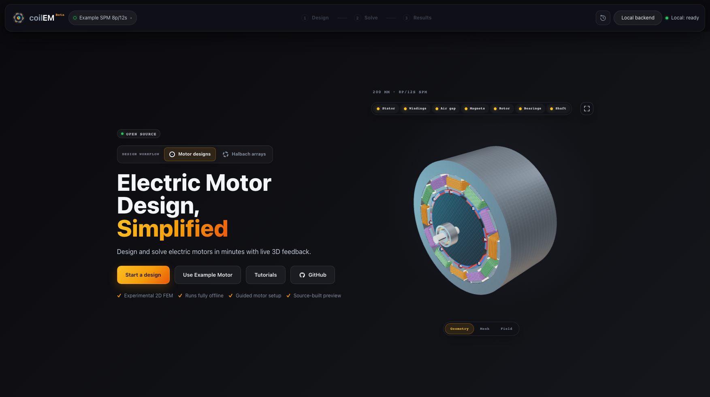

# coilEM — local electromagnetic design

coilEM is an open-source application for exploring electric motors and magnetic
fields. Edit a motor, inspect its geometry and mesh, run the bundled Magneto2D
solver, and compare saved results with field playback and PDF/CSV exports.
Everything runs on your computer.



**Experimental developer preview:** motor accuracy qualification is pending.
Use results for exploration and independent comparison. There is no installer
or supported operating-system matrix yet. See [Validation](docs/VALIDATION.md)
for measured evidence and remaining checks.

## Start from source

You need Python 3.11+, Node.js 24 with npm, and Rust with Cargo. Use a fresh
checkout and virtual environment. On Ubuntu/Debian, install the Gmsh system
library first: `sudo apt-get install libglu1-mesa`.

Windows PowerShell:

```powershell
py -3.11 -m venv .venv
.\.venv\Scripts\python.exe -m pip install -r requirements.lock
.\.venv\Scripts\python.exe -m pip install -e ".[dev]"
cargo build --release --locked --manifest-path solvers/magneto2d/Cargo.toml
.\.venv\Scripts\python.exe -m uvicorn backend.public_main:app --host 127.0.0.1 --port 8000
```

macOS or Linux:

```bash
python3 -m venv .venv
.venv/bin/python -m pip install -r requirements.lock
.venv/bin/python -m pip install -e ".[dev]"
cargo build --release --locked --manifest-path solvers/magneto2d/Cargo.toml
.venv/bin/python -m uvicorn backend.public_main:app --host 127.0.0.1 --port 8000
```

In a second terminal:

```sh
cd frontend
npm ci
npm run dev
```

Open [http://127.0.0.1:5173](http://127.0.0.1:5173), choose **Use Example
Motor**, and follow Design → Solve → Results. The [Getting started
guide](docs/GETTING_STARTED.md) explains the example, solve settings and exports.
The backend must stay bound to loopback.

## What you can explore

- Radial-flux SPM motor geometry, native Gmsh meshes, sinusoidal current and
  ideal wye-connected 120-degree six-step excitation.
- Loaded torque, phase and line Back-EMF, field plots, and harmonic spectra.
- Preview, Standard and High accuracy mesh/solve presets. These names describe
  resolution and sampling; they do not certify accuracy.
- Saved runs, comparison, project save/reopen, PDF, CSV and replay downloads.
- Solver-backed electromagnetics lessons and a cylindrical Halbach workspace.

## Limits to understand

The intended motor qualification is the included 8-pole/12-slot inner-rotor
SPM example using M350-50A steel. No motor path is release-qualified until the
exact-candidate numerical report passes. Other accepted geometries are
experimental.

Motor sweeps use per-angle meshes, with symmetry-based reuse where applicable,
without a sliding-band interface. Mesh changes can introduce numerical noise
into torque ripple and cogging. Check mesh and angular convergence before
interpreting small variations. A dedicated cogging result view is not included.
Six-step excitation models ideal commanded currents, without PWM, switching,
ESC dynamics or thermal behavior. See [Release notes](RELEASE_NOTES.md) and
[Materials](MATERIALS.md).

The application is **coilEM 0.2.0** and the solver is **Magneto2D 0.3.2**.
There are no accounts, hosted services or telemetry in this distribution.
Elmer is an optional development-only lane; see [its setup](docs/ELMER.md).

## Reproducibility and contributing

The public application ignores inherited numerical solver switches. It derives
native options from the request and records its environment policy and options
in new motor results. [Runtime settings](docs/RUNTIME_SETTINGS.md) lists public
configuration names. The `.openem` project format remains compatible.

Completed runs live outside the checkout in your OS user-data directory and
retain requests, results and hashes. See [local storage](docs/local_solve_workspace.md).
The root snapshot manifest records source provenance and file hashes. It is an
integrity record, not evidence of numerical accuracy.

See [Architecture](docs/ARCHITECTURE.md), [Magneto2D](docs/MAGNETO2D.md),
[the public API boundary](docs/PUBLIC_BOUNDARY.md), and
[Validation](docs/VALIDATION.md) for checks and numerical limitations.
Report bugs through [Support](SUPPORT.md), and vulnerabilities privately through
[Security](SECURITY.md). Source is licensed under AGPL-3.0-or-later; see
[LICENSE](LICENSE), [third-party notices](THIRD_PARTY_NOTICES.md) and
[trademark terms](TRADEMARKS.md).
