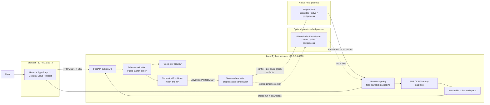

# coilEM architecture

This document describes the public, local-only coilEM application at a high
level. It covers the paths from both motor and non-motor Halbach definitions
in the browser to electromagnetic reports.

For solver command lines and physics boundaries, see
[Magneto2D](MAGNETO2D.md) and [Elmer FEM](ELMER.md). The solve-ready non-motor JSON interface is
documented separately in
[Generic magnetostatic field solver](GENERIC_MAGNETOSTATIC.md). To run the
application and complete an example analysis, see
[Getting started](GETTING_STARTED.md).

## System overview



The frontend does not run finite-element code. The Python service owns input
validation, geometry, meshing, process control, and durable storage.
Magneto2D owns its magnetostatic finite-element assembly, nonlinear solve, and
electromagnetic postprocessing. When explicitly selected, the optional Elmer
adapter produces Elmer cases, launches separately installed executables, and
maps their result files into the same public result contract.

## Component responsibilities

| Component | Responsibility |
| --- | --- |
| Public frontend | Edits a motor definition, displays geometry and mesh QA, streams solve progress, plots results, and downloads stored reports. |
| Public FastAPI service | Exposes the loopback API, validates requests, enforces the launch boundary, coordinates work, and sanitizes responses. |
| Geometry and Gmsh layer | Converts the motor definition into solver geometry, generates triangular meshes, tags physical regions, and rejects meshes that fail QA. |
| Python solver orchestration | Selects the rotor-angle plan, routes the explicit solver choice, produces mesh artifacts, handles progress/cancellation, and maps raw reports into the application result. |
| Magneto2D | Assembles and solves the 2D magnetostatic FEM system, iterates nonlinear steel, and computes torque, flux linkage, Back-EMF, and field outputs. |
| Optional Elmer adapter | Detects qualified user-installed executables, remeshes each rotor position, converts Gmsh meshes with ElmerGrid, runs ElmerSolver, and maps results without bundling or linking Elmer. |
| Solve workspace | Publishes a completed run atomically with inputs, provenance, immutable results, retained artifacts, PDF, CSV, and replay package. |

## A Halbach solve from end to end

The Halbach workspace validates `halbach_array_config` v1, creates a non-motor
planar artifact, and lowers it through a feature-tag-driven Gmsh adapter. The
adapter assigns every triangle one material and remanence source, then emits
the unchanged generic `magnetostatic_problem` v1 contract.

Magneto2D field mode solves that document without learning Halbach geometry or
report policy. Python samples bore and leakage regions, calculates
Halbach-specific metrics, embeds the complete generic field report, and keeps
the replayable problem/hash. See [Cylindrical Halbach array](HALBACH_ARRAY.md).

## A motor solve from end to end

### 1. Design and preview

The browser starts with a versioned motor configuration containing:

- topology, stator, rotor, and winding geometry;
- material identifiers;
- the operating point and mesh/solver settings; and
- requested electromagnetic outputs.

`POST /preview` validates that configuration and returns display geometry. This
path does not run the finite-element solver.

### 2. Mesh preparation

`POST /solver/mesh-preview` applies the public policy, validates the geometry,
builds Geometry IR, and asks Gmsh for a triangular mesh. Mesh QA checks such as
region coverage and minimum element quality run before a solve is allowed.

The backend converts the Gmsh result into a `SolveMeshArtifact`. That contract
contains the mesh, physical-region identity, boundary information, material
assignment provenance, magnetization, and winding current-density data needed
by Magneto2D. The frontend receives visualization data and an opaque
`solve_mesh_key`; raw cache paths are not an API contract.

### 3. Validation and solve

`POST /solve/validate` returns actionable validation errors, warnings, and
local estimates without starting a solve.

The application normally uses `POST /solve/stream`. The response is a
server-sent event stream with progress, followed by either a completed result
or a typed error. `POST /solve/cancel` stops the active local solve.

For rotor motion, the public launch lanes use native Gmsh meshes. Magneto2D
uses the normal public mesh policy. Elmer uses a fixed qualified profile with
remesh-per-position motion, Arkkio torque, and direct UMFPACK. Solver selection
is explicit; an unavailable Elmer runtime is reported before a solve starts.

### 4. Result mapping and report

The backend maps raw solver reports into the public result model. The report UI
can show:

- average torque and torque ripple;
- phase Back-EMF and its fundamental;
- torque and Back-EMF waveforms;
- peak tooth and yoke flux density;
- torque and Back-EMF constants;
- solver, mesh, material, and operating-point provenance; and
- solved magnetic field views and playback when requested.

Before the completed result is returned, coilEM writes the run to a partial
directory, generates its PDF, CSV, and replay package, hashes the evidence,
and atomically publishes the run. A completed run is immutable; reopening or
rerunning it restores inputs and starts a new analysis rather than modifying
the old evidence.

See [Local solve workspace](local_solve_workspace.md) for the directory layout,
retention policy, integrity checks, and replay behavior.

## Public API surface

The API is grouped into five small surfaces:

| Surface | Representative paths |
| --- | --- |
| Runtime facts | `GET /health`, `GET /materials`, `GET /openapi.json` |
| Design and mesh | Motor `/preview` and `/solver/mesh-preview`; Halbach `/halbach/preview` and `/halbach/mesh-preview` |
| Solve | `POST /solve/validate`, `POST /solve/stream`, `POST /solve`, `POST /solve/cancel` |
| Stored runs | `GET /runs`, run loading, PDF/CSV/package downloads, folder reveal, and explicit deletion |
| Tutorials | Local, solver-backed `/tutorials/*` lesson routes |
| Halbach application | `/halbach/solve/validate`, `/halbach/solve/stream`, and `/halbach/export/{kind}` |

The exact launch allowlist is documented in
[Public runtime boundary](PUBLIC_BOUNDARY.md).

## Important contracts

### Motor configuration

The Python model is the authoritative public request schema. It validates
dimensions, topology-specific fields, winding data, materials, solve settings,
and output options before meshing.

### Solve mesh artifact

The JSON artifact between Python/Gmsh and Rust keeps mesher-specific geometry
out of the numerical solver. It includes triangular connectivity in
millimeters at the JSON boundary; Magneto2D converts coordinates to SI units
before assembly.

### Magneto2D report envelope

Magneto2D emits a `solve_report`, `sweep_report`, or `batch_solve_reports`
envelope. The envelope records schema kind and provenance in addition to the
numerical payload.

### Durable run manifest

The run manifest binds the project, resolved request, material record, solver
version, application commit, result, retained artifacts, and exports with
hashes. Downloads are served from this stored run and do not start a solver.

## Runtime and trust boundary

- The public service binds to `127.0.0.1`, not to a LAN or public interface.
- The public frontend accepts only loopback API addresses.
- Browser origins are limited to the documented local development and preview
  ports.
- The launch configuration policy accepts Magneto2D with native Gmsh meshes,
  plus explicit Elmer when qualified Elmer 26.2 executables are detected.
- Cloud services, identity, billing, telemetry, FEMM, internal diagnostics,
  and thermal requests are outside the public launch runtime.
- The launch material set and its interpretation limits are documented in
  [Materials](../MATERIALS.md).

## Repository map

```text
frontend/src/public/          Public React application and API client
backend/public_main.py        Loopback FastAPI entry point and route allowlist
backend/public_routes/        Preview, solve, stored-run, and tutorial routes
backend/public_policy.py      Fail-closed launch configuration policy
backend/gmsh_solver.py        Native Gmsh mesh production and mesh QA
backend/halbach/              Non-motor geometry, mesh lowering, solve adapter, metrics, and exports
backend/elmer/                Optional external Elmer discovery, case generation, execution, and result mapping
backend/solver/               Python solve orchestration and result mapping
backend/magneto2d_adapter/    Rust process and JSON artifact adapter
backend/solve_workspace.py    Durable run storage and integrity checks
solvers/magneto2d/            Rust FEM solver and postprocessor
```
