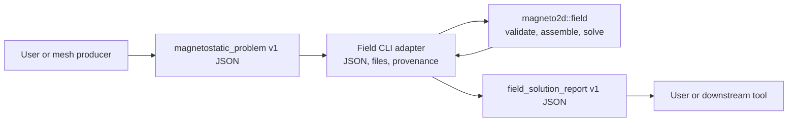

# Generic magnetostatic field solver

Magneto2D's field mode is a lower-level interface for solving a prepared 2D
planar magnetostatic finite-element problem without a motor configuration. It
accepts a versioned JSON document containing a P1 triangular mesh, materials,
per-element sources, boundary conditions, solver options, and optional warm
starts.

Use the normal coilEM application for motor design, meshing, rotor sweeps,
torque, flux linkage, and Back-EMF. Field mode is intended for users who
already have a solve-ready triangular mesh and need the reusable
magnetostatic core directly.

This page zooms in on the generic adapter. See the
[Magneto2D solver pipeline](MAGNETO2D.md#solver-pipeline) for the complete
motor-adapter, field-adapter, shared-core, and reporting relationship.

The authoritative machine-readable contracts are:

- [`magnetostatic_problem.schema.json`](../schemas/v1/magnetostatic_problem.schema.json);
- [`field_solution_report.schema.json`](../schemas/v1/field_solution_report.schema.json);
- [`field_current_square.json`](../schemas/v1/examples/field_current_square.json);
  and
- [`field_nonlinear_square.json`](../schemas/v1/examples/field_nonlinear_square.json).

## Architecture and responsibility boundary



The generic Rust core owns:

- SI-normalized mesh and physics contracts;
- contract validation;
- sparse P1 assembly;
- Direct Cholesky and PCG linear solution;
- Picard and damped Newton nonlinear iteration;
- typed progress and nonlinear diagnostic events; and
- nodal vector potential, element field, material-state, convergence, timing,
  and solver-profile results.

The CLI adapter owns reading and writing files, the JSON envelope, timestamps,
input hashing, and build provenance. The generic core does not read process
environment variables or write diagnostic files. Library callers can use
`magneto2d::field::solve` or `solve_with_sinks`; all solver policy arrives
through `SolveOptions` and callback traits.

The motor adapter uses the same neutral field contracts for assembly and
linear-solver preparation, but motor geometry, winding synthesis, material
catalog lookup, rotor motion, torque, flux linkage, Back-EMF, and motor report
schemas remain outside the generic core.

The cylindrical and linear Halbach applications also produce this contract.
Their Python layer owns array geometry, catalog/custom magnet semantics,
feature-tag-driven Gmsh meshing, application-specific sampling and reports,
and cylindrical demagnetization screening and exports. They pass only a prepared
`magnetostatic_problem` to the generic core. See
[Halbach arrays](HALBACH_ARRAY.md).

Field mode does not generate a mesh. It does not accept a motor
`SolveMeshArtifact`, `--mesh-input`, `--sweep`, or `--batch-input`.

## Quick start

Build Magneto2D from the repository root:

```text
cargo build --release --locked --manifest-path solvers/magneto2d/Cargo.toml
```

Run the checked-in linear current-density example:

```text
cargo run --release --locked --manifest-path solvers/magneto2d/Cargo.toml -- schemas/v1/examples/field_current_square.json --mode field -o field-current-report.json
```

Run the nonlinear B-H example:

```text
cargo run --release --locked --manifest-path solvers/magneto2d/Cargo.toml -- schemas/v1/examples/field_nonlinear_square.json --mode field -o field-nonlinear-report.json
```

Without `-o`, the JSON report is written to standard output. Contextual help
is available without an input file:

```text
cargo run --release --locked --manifest-path solvers/magneto2d/Cargo.toml -- help field
```

A validation or solve failure writes an error to standard error and exits
nonzero. It does not emit a successful `field_solution_report`.

## Input contract

Every input is a JSON object with these top-level fields:

| Field | Required | Meaning |
| --- | --- | --- |
| `kind` | yes | Must be `magnetostatic_problem`. |
| `version` | yes | Must be `1.0`. |
| `units` | yes | Declares the coordinate length unit. |
| `mesh` | yes | Nodes and P1 triangle connectivity. |
| `materials` | yes | Linear or nonlinear material models. |
| `elements` | yes | One material/source record per triangle. |
| `boundaries` | yes | Zero-Dirichlet anchors and optional paired nodes. |
| `options` | no | Explicit linear and nonlinear solver policy. |
| `warm_start` | no | Optional nodal and per-element initial state. |

Unknown JSON properties are rejected. This keeps the runtime contract aligned
with the schema and prevents misspelled options from silently using defaults.

### Units and mesh

`units.length` accepts `m`, `mm`, or `cm`. Node coordinates are normalized to
metres exactly once when the document becomes a core problem. Source values
are already SI and are not rescaled:

- current density: A/m2;
- remanence: T;
- B-H flux density: T; and
- B-H field strength: A/m.

`mesh.nodes` contains `[x, y]` coordinate pairs. `mesh.triangles` contains
three zero-based node indices per P1 triangle. Clockwise and
counter-clockwise triangles are accepted; repeated node indices, zero-area
triangles, out-of-range indices, and non-finite coordinates are rejected.

The mesh must span both coordinate axes. A finite nonzero bounding-box span
outside `[1e-4, 10]` metres is accepted with a `verify units.length` warning.
The warning does not modify the mesh or sources.

### Materials

Materials are indexed by their position in `materials`.

A linear material has:

```json
{"kind": "linear", "mu_r": 1.0}
```

`mu_r` is scalar, isotropic relative permeability and must be finite and at
least 1.

A nonlinear material has:

```json
{
  "kind": "nonlinear",
  "bh_curve": {
    "points": [
      {"b_t": 0.0, "h_a_per_m": 0.0},
      {"b_t": 1.0, "h_a_per_m": 500.0},
      {"b_t": 1.8, "h_a_per_m": 12000.0}
    ],
    "mu_r_min": 1.0,
    "mu_r_max": 10000.0
  }
}
```

The curve must begin at `(0, 0)`, contain at least two points, have strictly
increasing `b_t`, and have non-decreasing `h_a_per_m`. Magneto2D linearly
interpolates H between points and linearly extrapolates from the final
segment. `mu_r_min` and `mu_r_max` bound the secant permeability.

### Per-element physics

`elements` must have exactly one entry for every triangle, in triangle order:

```json
{
  "material_id": 0,
  "current_density_z_a_per_m2": 1000000.0,
  "remanence_t": [0.0, 1.2],
  "pm_source_scale": 1.0
}
```

| Field | Default | Meaning |
| --- | ---: | --- |
| `material_id` | none | Zero-based index into `materials`. |
| `current_density_z_a_per_m2` | `0` | Uniform out-of-plane current density in the element. Positive z is out of the x-y plane. |
| `remanence_t` | `[0, 0]` | Cartesian `[Br_x, Br_y]` permanent-magnet remanence. |
| `pm_source_scale` | `1` | Nonnegative multiplier applied to the remanence source. |

Current density and remanence may coexist in one element. Geometry-based
magnet fill fractions must be resolved by the producer and supplied through
`pm_source_scale`; the core does not infer them.

### Boundaries

At least one node must appear in `dirichlet_az_zero_nodes`. Every listed node
is constrained to `A_z = 0`. Entries must be unique and in range.

`paired_nodes` optionally couples two otherwise unassigned nodes:

```json
{
  "dirichlet_az_zero_nodes": [0, 1],
  "paired_nodes": [
    {"nodes": [2, 3], "kind": "periodic"},
    {"nodes": [4, 5], "kind": "anti_periodic"}
  ],
  "periodic_penalty": 10000000000.0
}
```

- `periodic` enforces `A_z(left) = A_z(right)`;
- `anti_periodic` enforces `A_z(left) = -A_z(right)`.

A node may have only one boundary assignment. A pair cannot contain the same
node twice or overlap a Dirichlet node. V1 applies paired constraints with
the positive `periodic_penalty`; exact constraint elimination is not part of
this release. Unlisted exterior edges receive the natural boundary condition
from the weak formulation.

### Linear options

| Field | Default | Valid values or range |
| --- | ---: | --- |
| `solver` | `direct` | `direct`, `pcg` |
| `pcg_preconditioner` | `incomplete_cholesky` | `incomplete_cholesky`, `jacobi` |
| `pcg_parallel` | `false` | Boolean |
| `pcg_residual_check_interval` | `8` | Integer >= 1 |
| `tolerance` | `1e-8` | `0 < value < 1` |
| `max_iterations` | `5000` | Integer >= 1 |

The direct path reuses one prepared CSR pattern and symbolic Cholesky analysis
through the nonlinear solve. If numeric Cholesky factorization is
unavailable, it falls back to PCG. A structural CSR mismatch is an error and
is never hidden by fallback. Field mode also treats a PCG iteration-cap exit
as non-convergence and emits no successful report.

### Nonlinear options

| Field | Default | Valid values or range |
| --- | ---: | --- |
| `algorithm` | `picard` | `picard`, `newton` |
| `max_iterations` | `100` | Integer >= 1 |
| `tolerance` | `0.05` | `0 < value < 1` |
| `relaxation` | `0.1` | `0 < value <= 1` |
| `mu_r_step_cap` | `1.5` | Value >= 1 |
| `newton_initial_damping` | `1` | `0 < value <= 1` |
| `newton_min_damping` | `0.015625` | Positive and no larger than initial damping |
| `newton_line_search_shrink` | `0.5` | `0 < value < 1` |
| `newton_line_search_accept_ratio` | `0.999` | `0 < value <= 1` |
| `newton_fallback_to_picard` | `true` | Boolean |

Picard updates each nonlinear element's secant permeability using
`relaxation`, bounded by `mu_r_step_cap`. Its reported compatibility residual
is the largest raw relative permeability mismatch multiplied by
`relaxation`.

Newton solves the relative equation residual
`norm(K(A_z) A_z - f) / max(norm(f), 1e-30)` and accepts only a damped
candidate below the configured line-search ratio. Newton tangent corrections
use PCG. If Newton fails and fallback is enabled, Picard restarts from the
original material and warm-start state; the report labels the algorithm
`newton_to_picard`.

### Warm starts

`warm_start` may contain:

```json
{
  "az_nodal": [0.0, 0.0, 0.0],
  "mu_r_by_element": [1.0]
}
```

An omitted or empty array means no warm start for that state. A nonempty
`az_nodal` array must have one finite value per node. A nonempty
`mu_r_by_element` array must have one finite value of at least 1 per element;
only nonlinear element values affect material initialization.

## Output contract

The CLI emits a `field_solution_report` envelope:

| Field | Meaning |
| --- | --- |
| `openem_schema_version` | Version of the common artifact envelope. |
| `openem_schema_kind` | `field_solution_report`. |
| `openem_provenance` | Timestamp, solver version and Git revision, host OS, and input path/hash/size. |
| `problem_kind` | `magnetostatic_problem`. |
| `problem_version` | `1.0`. |
| `normalized_length_unit` | Always `m`. |
| `solution` | Numerical result described below. |

`solution` contains:

| Field | Length or unit | Meaning |
| --- | --- | --- |
| `az_nodal` | one per node, T m | Solved out-of-plane magnetic vector potential. |
| `element_fields` | one per triangle, T | Objects containing `bx`, `by`, and `b_mag`. |
| `final_material_state` | one per triangle | Final `material_id`, `mu_r`, and reluctivity in m/H. |
| `convergence` | object | Algorithm, iteration history, and linear-solver policy. |
| `timings` | milliseconds | Total, preparation, assembly, linear solve, field recovery, and material update. |
| `profile` | counters and microsecond PCG timings | CSR/cache/Direct Cholesky and accumulated PCG activity. |
| `energy_per_unit_depth` | J/m | V1 field-energy summary per out-of-plane depth. |
| `warnings` | optional array | Non-fatal validation warnings, including unusual physical scale; omitted when empty. |

For a linear problem, `convergence.nonlinear` is `false`,
`nonlinear_algorithm` is `linear`, `nonlinear_iterations` is zero, and the
nonlinear residual history is empty.

For a nonlinear problem, every accepted outer iteration contributes one
entry to `nonlinear_residual_history`. `nonlinear_algorithm` is `picard`,
`newton`, or `newton_to_picard`. A returned report always has
`converged: true`; non-convergence is an error and produces no successful
report.

The profile distinguishes attempted policy from actual work. In particular,
`direct_successful_solves` records completed Direct Cholesky solves,
`direct_pcg_fallbacks` records numeric fallbacks, and `pcg.solve_calls`
records PCG invocations, including Newton tangent corrections.

## Physics and interpretation limits

Field mode deliberately has a narrow v1 boundary:

- It is a 2D planar magnetostatic formulation with scalar, isotropic material
  models. It does not resolve axial end effects.
- Inputs must already contain a conforming triangular mesh and per-element
  physics. Field mode does not accept CAD, generate geometry, or run Gmsh.
- It does not calculate generic force, torque, inductance, flux linkage, or
  Back-EMF.
- It has no electrical-circuit coupling, motion, transient or time-harmonic
  formulation, eddy-current model, hysteresis model, anisotropy, 3D
  formulation, or axisymmetric r-z formulation.
- V1 supports only zero-valued Dirichlet anchors and penalty-based periodic or
  anti-periodic node pairs. It does not support nonzero Dirichlet values or
  exact periodic elimination.
- `energy_per_unit_depth` uses the final secant reluctivity expression
  `0.5 * nu * |B|^2` integrated over the 2D mesh. Treat it as a v1 field
  summary, not as validated nonlinear co-energy or a force calculation.
- A scale warning is advisory. The solver cannot determine whether unusual
  dimensions or SI source magnitudes are intentional.

Validate important engineering results against mesh refinement, material
provenance, boundary placement, and an independent reference appropriate to
the problem.

## Verification

Run the two Quick start commands above to solve the checked-in inputs through
the real binary. Run the shipped Rust field-core suite for contract validation,
field solutions, and convergence behavior:

```text
cargo test --locked --manifest-path solvers/magneto2d/Cargo.toml field::tests
```

Run all Magneto2D targets:

```text
cargo test --all-targets --locked --manifest-path solvers/magneto2d/Cargo.toml
```
