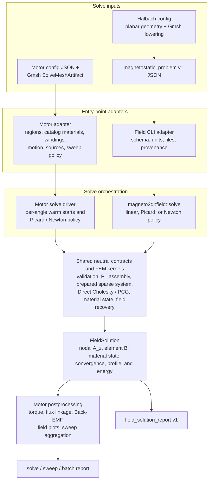
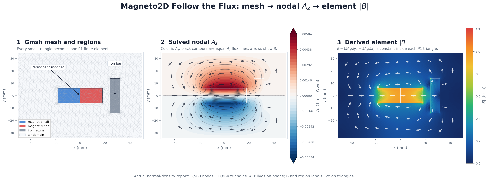
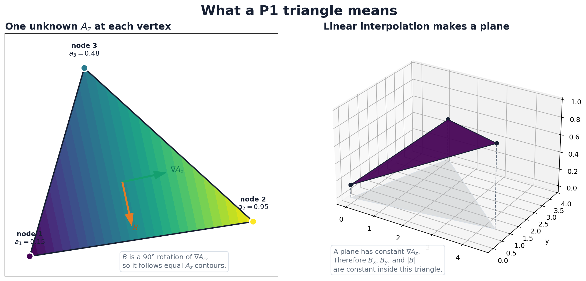
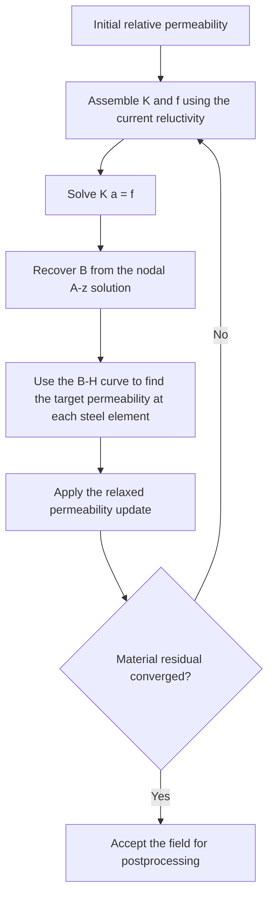

# Magneto2D

Magneto2D 0.3.2 is coilEM's native Rust 2D magnetostatic finite-element solver
and postprocessor. It is bundled by the coilEM 0.2.0 application; the solver
and application have separate version numbers. The public application uses
Python and Gmsh to build tagged solve meshes, then invokes Magneto2D for field
solving and electromagnetic postprocessing.

Most users should run Magneto2D through the coilEM application. Its
`magnetostatic` mode accepts a motor configuration plus a backend-produced
Gmsh solve-mesh artifact. The same binary also exposes `field`, a lower-level
interface for a prepared, non-motor magnetostatic problem.

This guide explains the complete solver and how those two entry points meet.
See [Generic magnetostatic field solver](GENERIC_MAGNETOSTATIC.md) for the
field-mode JSON contract, commands, output fields, convergence semantics, and
limitations.

## Public motor-workflow boundary

| Area | Developer-preview boundary |
| --- | --- |
| Physics | 2D magnetostatic FEM with nonlinear electrical steel |
| Motor qualification target | Included 8-pole/12-slot surface-PM example, Standard plan; qualification pending |
| Other accepted motor paths | Preview capabilities only; not launch-validated accuracy claims |
| Mesh producer | Native Gmsh only |
| Concentrated windings | Single layer |
| Distributed windings | Balanced one- or two-layer star-of-slots layouts with `q >= 1`; explicit short pitch is limited to supported integer-`q` layouts |
| Electrical steel | Bundled M350-50A nonlinear reference model or project-local imported B-H curves |
| Preview result surface | Loaded torque, torque ripple, flux linkage, Back-EMF, field values/plots, and solver/mesh provenance |
| Harmonic tiers | Preview: waveform only; Standard: THD and H1-H12; High accuracy (`fine`): THD and H1-H24 |
| Saved-run comparison | Descriptive comparison of two Magneto2D runs; no parity or certification claim |
| Outside launch scope | FEMM, thermal analysis, supplier-specific loss prediction, demagnetization safety, and internal debug workflows |

This table describes the coilEM motor workflow, not every problem that the
generic field interface can represent. The backend is the authoritative motor
support gate: a motor configuration can satisfy the JSON schema and still be
rejected when its topology, winding, mesh source, or material lies outside
this boundary. A dedicated cogging-torque results view is not included in the
0.2.0 preview. Field mode has its own versioned, solve-ready contract and does
not imply public support for a new motor topology.
No motor path is release-qualified; see [Validation](VALIDATION.md).
The public API rejects requests with `solve_options.cogging_torque = true`.

## Solver pipeline

Magneto2D has two production adapters around shared neutral field contracts
and numerical infrastructure:



The diagram shows responsibility and data flow, not identical top-level
orchestration. The motor driver retains motor-specific sweep, warm-start,
fallback, and reporting policy. `magneto2d::field::solve` owns the generic
linear and nonlinear solve policy. Both use the neutral field types and
shared FEM kernels, and both produce a `FieldSolution` before their
entry-point-specific reporting continues.

| Concern | Motor `magnetostatic` mode | Generic `field` mode | Shared layer |
| --- | --- | --- | --- |
| Caller supplies | Motor configuration and `SolveMeshArtifact` | `magnetostatic_problem` v1 | Typed SI-normalized mesh, element physics, boundaries, and `SolveOptions` |
| Adapter resolves | Motor regions, material catalog entries, windings, rotor motion, and per-angle sources | JSON schema, declared units, per-element sources, explicit materials, and optional warm start | Contract validation and reusable numerical data structures |
| Solve policy | Motor per-angle Picard/Newton, fallback, cache, and sweep policy | Explicit linear/Picard/Newton options from the input document | P1 assembly, prepared sparse systems, Direct Cholesky/PCG, field recovery, and diagnostics |
| Result continues to | Torque, flux linkage, Back-EMF, plots, sweeps, and motor report envelopes | `field_solution_report` v1 | `FieldSolution`: `A_z`, `B`, material state, convergence, timings/profile, and energy |

Use the motor workflow when coilEM owns motor design, meshing, winding
excitation, rotor positions, and electromagnetic postprocessing. Use
[field mode](GENERIC_MAGNETOSTATIC.md) when another tool already owns those
choices and can provide a solve-ready triangular problem. Field mode does not
accept a motor `SolveMeshArtifact`; the adapters meet only after translating
their inputs into the neutral Rust contracts.

The [cylindrical Halbach workspace](HALBACH_ARRAY.md) is a first-party producer
of field-mode input. Its Python application layer owns annular geometry,
material resolution, Gmsh meshing, and Halbach report metrics; Magneto2D still
receives only the same generic problem and its numerical physics is unchanged.

In either path, Magneto2D solves for the out-of-plane magnetic vector
potential `A_z` on a triangular mesh. Element fields are derived from `A_z`
after convergence. The motor workflow then uses those fields for torque,
flux-linkage, Back-EMF, and flux-density summaries, while field mode returns
the neutral field solution directly.

## Detailed Design: From Mesh to FEM Solution

The most useful mental model is that Magneto2D assigns one unknown, $A_z$, to
every mesh node. It turns the geometry, materials, magnets, and winding
currents into a sparse matrix equation, solves that equation for the nodal
$A_z$ values, and then derives the magnetic flux density from their spatial
variation:

```math
\begin{aligned}
\text{mesh, materials, and sources}
&\;\Longrightarrow\;
\mathbf K(A_z)\,\mathbf a = \mathbf f
\\[4pt]
&\;\Longrightarrow\;
\mathbf B
= \nabla \times \left(A_z\hat{\mathbf z}\right)
=
\begin{bmatrix}
\dfrac{\partial A_z}{\partial y}\\[3pt]
-\dfrac{\partial A_z}{\partial x}
\end{bmatrix}
\\[4pt]
&\;\Longrightarrow\;
\text{neutral field solution}
\;\Longrightarrow\;
\begin{cases}
\text{motor postprocessing and reports},\\
\text{generic field-solution report}.
\end{cases}
\end{aligned}
```

Here, $\mathbf a$ is the vector containing one $A_z$ value per mesh node,
$\mathbf K$ is the global magnetic stiffness matrix, and $\mathbf f$ is the
source vector. $\mathbf K(A_z)$ is written with an $A_z$ dependency because
nonlinear steel makes its entries depend on the field being solved.

The three views below come from the checked-in Follow the Flux
magnet-and-iron report:



From left to right:

1. Gmsh divides the air, permanent magnet, and iron bar into connected
   triangles. Smaller triangles near material corners capture rapid field
   changes.
2. Magneto2D solves one scalar $A_z$ value at every node. A contour joins
   points with equal $A_z$. Since $\mathbf B$ is a 90-degree rotation of
   $\nabla A_z$, the magnetic field runs along these contours; this is why
   equal-$A_z$ lines are drawn as flux lines.
3. Magneto2D differentiates the nodal $A_z$ solution to obtain $B_x$ and
   $B_y$. With P1 elements, those derivatives and therefore $|\mathbf B|$ are
   constant inside each triangle.

$A_z$ is not the magnetic flux density. It is the out-of-plane component of
the magnetic vector potential used to represent a 2D in-plane field. Its
absolute zero is a reference fixed here by the outer boundary condition; its
spatial changes are what produce the physical $\mathbf B$ field. Red and blue
in the middle panel mean positive and negative $A_z$, not north and south
magnetic poles.

### 1. Load and validate the solve problem

The two adapters begin with different public documents. In the motor
workflow, the Gmsh `SolveMeshArtifact` supplies:

- node coordinates in millimeters;
- triangles as three node indices;
- a region assignment for every triangle;
- boundary nodes and, for sector models, paired sector-edge nodes;
- airgap and mesh metadata; and
- a physics contract that maps regions to materials, magnetization, motion,
  and winding sources.

In field mode, `magnetostatic_problem` instead supplies the triangular mesh,
declared coordinate unit, explicit material models, one physics/source record
per element, boundary conditions, solver options, and an optional warm start.
It deliberately contains no motor topology, winding synthesis, material
catalog lookup, or rotor-motion contract.

Each adapter validates its public document and converts it to the shared
neutral problem types. The neutral validation then checks array sizes,
indices, triangle geometry, material and source references, boundary
conditions, finite values, and solver options. Coordinates are normalized to
SI meters before assembly.

For the requested rotor position, Magneto2D prepares one material record and
one current-density value for every triangle. A material record contains the
quantities needed by the field equation, including:

```math
\begin{aligned}
\mu_r &:\quad \text{relative permeability}
\\
\nu &= \frac{1}{\mu_0\mu_r}
&& \text{magnetic reluctivity}
\\
B_r &:\quad \text{permanent-magnet remanence}
\\
\theta_m &:\quad \text{magnetization direction}
\end{aligned}
```

Air and winding regions have $\mu_r$ close to 1. Permanent magnets also carry
$B_r$ and a direction. Electrical-steel triangles receive either a constant
permeability or an initial permeability obtained from their B-H curve.

### 2. Represent A<sub>z</sub> with P1 triangular elements

`P1` means *first-order triangular element*. In plain language, Magneto2D:

1. solves for one $A_z$ value at each corner of a triangle; and
2. draws the only flat plane that passes through those three corner values.

It does **not** solve for additional values inside the triangle. Interior
values come from linear interpolation between the corners.



The vertical direction in this illustration is the value of $A_z$, not a
third physical dimension. For this illustrative triangle, suppose the solver
has found:

```math
a_1=0.15,\qquad a_2=0.95,\qquad a_3=0.48.
```

Here, $a_1$, $a_2$, and $a_3$ are simply the $A_z$ values at nodes 1, 2,
and 3. Their different heights define the tilted plane shown on the right.

#### How Magneto2D finds a value between the nodes

At any point $(x,y)$ inside the triangle, Magneto2D blends the three corner
values:

```math
A_z(x,y)
\;\approx\;
a_1\phi_1(x,y)+a_2\phi_2(x,y)+a_3\phi_3(x,y)
```

The $\phi$ terms are interpolation weights, also called *basis functions*.
They answer, “How much influence does each corner have at this location?”
Inside the triangle:

```math
0\leq\phi_i\leq1,
\qquad
\phi_1+\phi_2+\phi_3=1.
```

Their values at several useful locations are:

| Location | $\phi_1$ | $\phi_2$ | $\phi_3$ | Interpolated $A_z$ |
| --- | ---: | ---: | ---: | --- |
| Node 1 | 1 | 0 | 0 | $a_1$ |
| Node 2 | 0 | 1 | 0 | $a_2$ |
| Node 3 | 0 | 0 | 1 | $a_3$ |
| Triangle center | $1/3$ | $1/3$ | $1/3$ | $(a_1+a_2+a_3)/3$ |

For the example in the figure, the value at the triangle center is therefore:

```math
A_z(\text{center})
=
\frac{0.15+0.95+0.48}{3}
\approx
0.527.
```

The weights change linearly as the point moves across the triangle. Near node
2, for example, $\phi_2$ is large, so the interpolated value is closer to
$a_2=0.95$.

#### Why one triangle has one constant B vector

The three corner $A_z$ values form a flat plane. A flat plane has one
constant slope, so both spatial derivatives of $A_z$ are constant inside the
triangle:

```math
\nabla A_z
=
\begin{bmatrix}
\dfrac{\partial A_z}{\partial x}\\[4pt]
\dfrac{\partial A_z}{\partial y}
\end{bmatrix}
=
\text{constant inside the triangle}.
```

Magneto2D rotates that slope by 90 degrees to recover the in-plane magnetic
flux density:

```math
\mathbf B
=
\begin{bmatrix}
B_x\\[2pt]
B_y
\end{bmatrix}
=
\begin{bmatrix}
\dfrac{\partial A_z}{\partial y}\\[5pt]
-\dfrac{\partial A_z}{\partial x}
\end{bmatrix}.
```

This is why:

- each mesh node contributes one unknown $A_z$ value to the solver;
- neighboring triangles share the unknowns at their common nodes; and
- each P1 triangle produces one constant $B_x$, $B_y$, and $|\mathbf B|$
  result.

The colored triangle is not a separate physical layer. Its color represents
the interpolated scalar $A_z$. The frontend may interpolate or average the
element fields for a smoother display, but the underlying P1 result remains
nodal $A_z$ with one constant $\mathbf B$ vector per triangle.

### 3. Assemble each triangle into the global FEM system

Magneto2D solves the 2D magnetostatic equation:

```math
-\nabla\cdot\left(\nu\nabla A_z\right)
\;=\;
J_z+\left(\nabla\times\mathbf M\right)_z
```

For every triangle, it calculates the triangle area and the gradients of its
three basis functions. It then forms a 3-by-3 local stiffness matrix:

```math
K_{ab}^{(e)}
=
\int_{\Omega_e}
\nu_e\,\nabla\phi_a\cdot\nabla\phi_b\,d\Omega
=
\nu_e
\left(\nabla\phi_a\cdot\nabla\phi_b\right)
\left|\Omega_e\right|
```

The triangle also contributes to a three-entry local source vector:

```math
\begin{aligned}
f_{a}^{(e,J)}
&=
\int_{\Omega_e}J_z\phi_a\,d\Omega
=
\frac{J_z\left|\Omega_e\right|}{3},
\\[6pt]
f_{a}^{(e,\mathrm{PM})}
&=
\nu_e B_r
\left(
m_x\frac{\partial\phi_a}{\partial y}
-
m_y\frac{\partial\phi_a}{\partial x}
\right)
\left|\Omega_e\right|.
\end{aligned}
```

The local row and column numbers are mapped to the triangle's three global
node numbers. Contributions from all triangles sharing a node are added
together. The result is:

```math
\boxed{\mathbf K\,\mathbf a=\mathbf f}
```

$\mathbf K$ is sparse because a node couples only to nodes that share a
triangle with it. Magneto2D stores the matrix in compressed sparse row (CSR)
form. The mesh connectivity does not change during Picard iterations, so it
builds and caches the CSR sparsity pattern once, then only refills the
numerical values.

Finally, Magneto2D applies the model constraints:

- $A_z=0$ on the outer boundary; and
- periodic or anti-periodic coupling on sector edges when a sector model is
  used.

These constraints remove the arbitrary constant in $A_z$, close the linear
system, and preserve the symmetric matrix structure needed by the linear
solvers.

### 4. Decide whether one linear solve is enough

For linear materials, $\nu$ is known before the solve. Magneto2D assembles
$\mathbf K$ and $\mathbf f$ once and solves
$\mathbf K\mathbf a=\mathbf f$ once.

Electrical steel is different. Its B-H curve says that permeability changes
with flux density:

```math
\mu_r(|\mathbf B|)
\;\xrightarrow{\;\nu=1/(\mu_0\mu_r)\;}
\mathbf K(\nu)
\;\xrightarrow{\;\mathbf K\mathbf a=\mathbf f\;}
\mathbf a
\;\xrightarrow{\;\mathbf B=\nabla\times(A_z\hat{\mathbf z})\;}
\mathbf B
\;\xrightarrow{\;\text{B-H curve}\;}
\mu_r(|\mathbf B|)
```

This circular dependency makes the FEM problem nonlinear. Magneto2D resolves
it with either Picard fixed-point iteration, which is the default, or a
requested damped Newton method.

### 5. Picard iteration

Picard iteration repeatedly freezes the material properties, solves a linear
problem, and updates the properties:



For each steel triangle, the B-H table is interpolated to obtain $H$ at the
current $|\mathbf B|$. Magneto2D converts that point to a secant relative
permeability:

```math
\mu_{r,e}^{\mathrm{target}}
=
\frac{|\mathbf B_e|}{\mu_0\,H(|\mathbf B_e|)}
```

It does not normally jump straight to the target. The update is relaxed:

```math
\mu_{r,e}^{(k+1)}
=
\mu_{r,e}^{(k)}
+
\omega
\left(
\mu_{r,e}^{\mathrm{target}}
-
\mu_{r,e}^{(k)}
\right)
```

The default relaxation factor $\omega$ is `0.1`. Relaxation reduces oscillation
around the knee of the B-H curve, where a small change in $\mathbf B$ can cause
a large change in permeability. The relaxed update is also capped to the range
$\mu_r^{(k)}/1.5$ through $1.5\mu_r^{(k)}$ by default. Optional adaptive
relaxation and backtracking can reduce the step further when the material
residual grows.

The raw material residual is the largest relative permeability mismatch over
all steel triangles:

```math
\begin{aligned}
r_{\mathrm{raw}}^{(k)}
&=
\max_{e\in\mathrm{steel}}
\left|
\frac{
\mu_{r,e}^{\mathrm{target}}-\mu_{r,e}^{(k)}
}{
\mu_{r,e}^{(k)}
}
\right|,
\\[6pt]
r_{\mathrm{conv}}^{(k)}
&=
\omega_{\mathrm{initial}}\,
r_{\mathrm{raw}}^{(k)}.
\end{aligned}
```

The convergence residual is compared with a default threshold of `0.075` for
quick/standard quality or `0.05` for fine quality, with a default limit of 100
nonlinear iterations. A failure to reach the threshold is reported as an
error rather than silently treating an unconverged material state as final.

When PCG is used, the previous $A_z$ vector is a warm start for the next
Picard solve. Rotor sweeps can also warm-start a position from a nearby solved
position. If adaptive inner PCG tolerance is explicitly enabled, intermediate
Picard solves may use a looser residual tolerance, followed by one tight solve
before postprocessing.

### 6. Damped Newton iteration

Newton's method works with the residual of the complete nonlinear equation:

```math
\mathbf R(\mathbf a)
=
\mathbf K(\mathbf a)\,\mathbf a-\mathbf f
=
\mathbf 0
```

At each iteration, Magneto2D:

1. computes the current field and nonlinear material state;
2. evaluates the residual $\mathbf R(\mathbf a)$;
3. assembles a tangent matrix containing both the ordinary $\nu$ stiffness and
   a $d\nu/d|\mathbf B|$ correction from the B-H curve;
4. solves the Newton correction; and
5. proposes a damped candidate:

```math
\begin{aligned}
\mathbf J(\mathbf a)\,\Delta\mathbf a
&=
-\mathbf R(\mathbf a)
=
\mathbf f-\mathbf K(\mathbf a)\mathbf a,
\\[5pt]
\mathbf a_{\mathrm{candidate}}
&=
\mathbf a+\lambda\,\Delta\mathbf a.
\end{aligned}
```

6. Magneto2D accepts the step only when it reduces the nonlinear residual.

The line-search damping $\lambda$ starts at 1. If the full Newton step does not
reduce the residual, Magneto2D repeatedly halves it until it finds an
acceptable step or reaches the minimum damping.

For a loaded problem, Newton normally uses current continuation: it solves
25%, 50%, 75%, and then 100% of the requested current, using each converged
stage as the next stage's initial state. This makes difficult saturated
operating points easier to reach.

The initial field solve for a Newton stage uses the normal linear-solver
selection. The current Newton tangent-correction implementation uses PCG with
a relative tolerance of `1e-8`. If Newton or its line search fails,
Magneto2D restores the base material state and retries the angle with Picard.

### 7. Sparse Direct Cholesky

After boundary conditions, the ordinary magnetostatic stiffness matrix is
expected to be symmetric positive definite. Cholesky factorization represents
it as:

```math
\mathbf K=\mathbf L\mathbf L^\mathsf T
```

Solving $\mathbf K\mathbf a=\mathbf f$ then becomes two triangular
substitutions:

```math
\begin{aligned}
\mathbf L\mathbf y &= \mathbf f,
\\
\mathbf L^\mathsf T\mathbf a &= \mathbf y.
\end{aligned}
```

This is called a *direct* solver because it does not approach the answer
through residual iterations. Subject to floating-point roundoff, the
factorization and substitutions produce the solution in a fixed sequence of
operations.

Magneto2D uses the `faer` sparse LLT implementation and selects this path by
default for the ordinary stiffness solve. It divides the work into:

- **symbolic factorization:** determine ordering, fill-in, and the nonzero
  structure of $\mathbf L$; and
- **numeric factorization:** calculate the values in $\mathbf L$ for the current
  matrix coefficients.

The symbolic work depends only on mesh connectivity, so Magneto2D caches it
for the mesh. During Picard iteration, changing steel permeability changes the
matrix values but not its sparsity pattern. Each iteration therefore reuses
the symbolic analysis, performs a new numeric factorization, and executes the
two triangular solves.

If sparse Cholesky is unavailable for a matrix or its numeric factorization
fails, Magneto2D transparently falls back to PCG. Setting
`MAGNETO2D_LINEAR_SOLVER=pcg` explicitly selects PCG instead.

### 8. Preconditioned Conjugate Gradient (PCG)

PCG is an iterative solver for symmetric positive-definite systems. Starting
from zero or a warm-started $A_z$, it repeatedly chooses a search direction
that reduces the equation residual:

```math
\mathbf r=\mathbf f-\mathbf K\mathbf a,
\qquad
\frac{\lVert\mathbf r\rVert_2}{\lVert\mathbf f\rVert_2}
< \varepsilon_{\mathrm{linear}}.
```

It stops when the relative residual reaches the requested tolerance. Ordinary
final solves use $10^{-8}$; the teaching solver uses its own tighter setting
described below.

Magneto2D's default PCG preconditioner is incomplete Cholesky with zero
fill-in, written `IC(0)`. It approximates $\mathbf K$ cheaply so PCG needs fewer
iterations. If `IC(0)` cannot be built, Magneto2D falls back to a Jacobi
diagonal preconditioner.

Incomplete Cholesky and Direct Cholesky are not the same operation:

| Property | Direct Cholesky | PCG with `IC(0)` |
| --- | --- | --- |
| Purpose | Solves the system | Accelerates an iterative solve |
| Factorization | Includes required sparse fill-in | Keeps only the original lower-triangle pattern |
| Iterations | None | Repeats until the residual tolerance or iteration limit |
| Warm start | Not used | Reuses a previous $A_z$ effectively |
| Magneto2D use | Default ordinary stiffness solve | Forced mode, automatic fallback, and Newton tangent corrections |

### 9. Recover fields and calculate results

Once $A_z$ has converged, Magneto2D calculates the field in every triangle:

```math
\boxed{
\begin{aligned}
B_x &= \frac{\partial A_z}{\partial y},
\\[4pt]
B_y &= -\frac{\partial A_z}{\partial x},
\\[4pt]
|\mathbf B| &= \sqrt{B_x^2+B_y^2}.
\end{aligned}
}
```

It then derives the requested outputs, including:

- airgap flux-density samples and peak values;
- torque using the configured airgap stress/contour methods;
- phase flux linkage;
- Back-EMF from the change in flux linkage across rotor positions;
- magnetic energy and coenergy diagnostics; and
- the nodal and element arrays used for field plots.

A sweep repeats the per-angle process, normally reusing mesh structure and
nearby nonlinear states where the rotation model permits it, then aggregates
the angle results into torque, flux-linkage, and Back-EMF waveforms.

### Teaching-mode exception

The learning fixtures reuse the P1 assembly and field postprocessing, but they
have a deliberately smaller solve path:

| Teaching fixture | Material treatment | Linear solver |
| --- | --- | --- |
| Follow the Flux, including magnet plus iron bar | Linear; the iron return uses fixed `mu_r = 1000` | PCG once, maximum 8,000 iterations, tolerance `1e-10` |
| Iron Saturation | Relaxed B-H material loop, maximum 60 iterations | PCG once per material iteration, tolerance `1e-10` |

Therefore the magnet-and-iron tutorial command shown earlier does **not** run
the production motor Picard/Newton loop or Direct Cholesky. It assembles one
linear teaching FEM system, solves it with PCG, computes `B`, and returns the
teaching report. The dedicated Iron Saturation lesson is the teaching fixture
that demonstrates nonlinear permeability.

### Implementation map

| Concern | Rust source |
| --- | --- |
| Generic field contracts, validation, solve driver, diagnostics, and report types | `solvers/magneto2d/src/field.rs` |
| CLI mode dispatch, field JSON adapter, and report envelope | `solvers/magneto2d/src/lib.rs` |
| Motor mesh/material/source adapter into neutral field contracts | `solvers/magneto2d/src/solve/problem.rs` |
| Mesh validation and SI conversion | `solvers/magneto2d/src/solve/context.rs` |
| Per-angle materials and winding sources | `solvers/magneto2d/src/solve/problem.rs` |
| P1 stiffness and source assembly | `solvers/magneto2d/src/assembly.rs` |
| Picard iteration and relaxed material updates | `solvers/magneto2d/src/solve/picard.rs` |
| Newton tangent, correction, and line search | `solvers/magneto2d/src/solve/newton.rs` |
| Linear-solver selection | `solvers/magneto2d/src/solve/mod.rs` |
| Direct Cholesky, PCG, and preconditioners | `solvers/magneto2d/src/sparse.rs` |
| Field recovery and electromagnetic postprocessing | `solvers/magneto2d/src/postprocess.rs` |
| Teaching-fixture solve path | `solvers/magneto2d/src/teaching.rs` |

## Build and inspect the CLI

From the repository root:

```text
cargo build --release --locked --manifest-path solvers/magneto2d/Cargo.toml
cargo run --release --locked --manifest-path solvers/magneto2d/Cargo.toml -- --help
```

The backend performs the same release build automatically if the binary is
missing or older than its Rust sources.

## Discover valid options

General help lists every top-level flag and the available help topics:

```text
magneto2d --help
```

List the values accepted by `--mode`:

```text
magneto2d help modes
magneto2d --mode --help
```

Show the options and required inputs for each command form:

```text
magneto2d help single
magneto2d help sweep
magneto2d help batch
magneto2d help field
magneto2d help teaching
magneto2d help thermal
```

Help can also follow a valid mode:

```text
magneto2d --mode magnetostatic --help
magneto2d --mode field --help
magneto2d --mode teaching --help
magneto2d --mode thermal --help
```

When running through Cargo, place Cargo's argument separator before the
Magneto2D arguments. For example:

```text
cargo run --release --locked --manifest-path solvers/magneto2d/Cargo.toml -- help sweep
cargo run --release --locked --manifest-path solvers/magneto2d/Cargo.toml -- --mode teaching --help
```

## Command forms

The examples below use placeholders because the mesh artifact is produced by
the Python/Gmsh layer and is specific to the motor configuration.

### Single rotor angle

```text
cargo run --release --locked --manifest-path solvers/magneto2d/Cargo.toml -- path/to/config.json --mesh-input path/to/solve-mesh.json --rotor-angle-deg 15 -o output/single-report.json
```

`--rotor-angle-deg` is a mechanical angle. Omitting it uses zero mechanical
degrees.

### Fixed-mesh rotor sweep

```text
cargo run --release --locked --manifest-path solvers/magneto2d/Cargo.toml -- path/to/config.json --mesh-input path/to/solve-mesh.json --sweep 24 --sweep-span-deg 360 --workers 4 -o output/sweep-report.json
```

`--sweep-span-deg` is electrical. A fixed mesh is valid only when the artifact
and requested rotor-motion policy permit reuse. The public application normally
uses per-angle Gmsh remeshing for motor sweeps.

### Imported per-angle batch

```text
cargo run --release --locked --manifest-path solvers/magneto2d/Cargo.toml -- path/to/config.json --batch-input path/to/batch.json --workers 4 -o output/batch-report.json
```

A batch has this high-level shape:

```json
{
  "keep_first_field_plot": true,
  "keep_all_field_plots": false,
  "jobs": [
    {
      "rotor_angle_deg": 0.0,
      "solve_mesh_artifact": {}
    }
  ]
}
```

Each job carries a complete `SolveMeshArtifact`; an empty object is shown only
to illustrate the container shape.

## CLI options

| Option | Meaning |
| --- | --- |
| `-h`, `--help` | Print general or contextual help and exit. |
| `--mode MODE` | Select `magnetostatic` (default), generic `field`, `teaching`, or the gated `thermal` mode. |
| `--sweep [N]` | Run a rotor sweep. If `N` is omitted, the CLI uses 18 positions. |
| `--sweep-span-deg DEG` | Set the electrical sweep span; the default is 360 degrees. |
| `--serial` | Use one worker when no worker override is set. |
| `--workers N` | Use `N` Rayon worker threads for sweep or batch positions. |
| `--rotor-angle-deg DEG` | Set the mechanical angle for a single solve. |
| `--mesh-input PATH` | Reuse one `SolveMeshArtifact` for a single solve or compatible sweep. |
| `--batch-input PATH` | Run jobs carrying per-angle imported mesh artifacts. |
| `--field-diagnostics` | Enable high-volume airgap field diagnostics. |
| `--assert-symmetry` | Enable per-quadrant solver assertions. |
| `-o PATH` | Write the JSON report to a file. Without `-o`, JSON is written to standard output. |

Do not use `--mesh-only` or `--mesher`; both were removed from the Rust CLI.
Mesh creation and mesh preview belong to the Python/Gmsh backend.

The batch, sweep, and single-angle forms are alternatives. Avoid combining
them in one command.

## Environment controls

These controls apply to direct CLI experiments. The public application's
native processes use request-derived options and ignore inherited numerical
switches; see [Runtime settings](RUNTIME_SETTINGS.md).

| Variable | Effect |
| --- | --- |
| `COILEM_MAGNETO2D_WORKERS` | Default worker count when `--workers` is omitted. |
| `COILEM_MAGNETO2D_FIELD_DIAGNOSTICS` | Enables the same high-volume diagnostics as `--field-diagnostics` when set to a truthy value. |
| `MAGNETO2D_ASSERT_SYMMETRY` | Enables symmetry assertions when set to a truthy value. |

Worker selection precedence is `--workers`, then
`COILEM_MAGNETO2D_WORKERS`, then `--serial`, then the Rayon default.

Nonlinear method, linear solver/preconditioner, torque method, current
convention, mesh density, and requested outputs are normally selected through
the motor configuration so that they are preserved in result provenance.

## Configuration semantics that matter

### Current amplitude

`solve_params.current_amplitude_A` follows
`solve_params.current_amplitude_convention`:

- `peak` uses the supplied phase-peak value; and
- `rms` converts the supplied value to phase peak before synthesizing the
  three-phase waveform.

Ideal six-step excitation uses `plateau`: the supplied value is the commanded
current in each conducting phase. The guided public path is inner-rotor SPM,
wye-connected, with `excitation_mode = ideal_six_step_120`.

### Current angle

`solve_params.current_angle_deg` is an electrical phase advance applied to the
rotor-synchronous stator-current phasor. If it is explicitly present, the
solver uses that value. The report records both requested and resolved
operating-point values.

### Rotor angles

The CLI's single-angle flag is mechanical, while sweep positions and spans are
reported in electrical degrees. The pole-pair conversion is derived from the
motor configuration.

### Mesh units

Mesh-node coordinates are expressed in millimeters at the JSON boundary and
converted to SI units inside Magneto2D. Region, boundary, magnetization, and
current-density metadata must align with the mesh element arrays.

## Reports and process output

Magneto2D emits one of these envelope kinds:

| Command | Report kind |
| --- | --- |
| Single angle | `solve_report` |
| Sweep | `sweep_report` |
| Imported batch | `batch_solve_reports` |
| Teaching fixture | Direct `TeachingReport` object |

Production-motor JSON includes schema identity and provenance alongside the
numerical payload. Teaching mode returns the `TeachingReport` directly.
Human-readable status and progress are written to standard error so standard
output can remain machine-readable JSON.

The checked-in
[Follow the Flux magnet-and-iron report](examples/follow-flux-magnet-iron-report.json)
is a complete output from the normal-mesh Gmsh tutorial path. It includes the
mesh (`nodes_mm`, `triangles`, and `regions`), solved field arrays
(`az_nodal`, `element_b_mag_t`, `element_bx_t`, and `element_by_t`), summary
`metrics`, and backend-generated `contour_levels`. It is intentionally much
larger than a configuration file because the frontend uses those arrays to
render the solved field.

### Follow the Flux output shape

The following is an abridged view of that report. `...` marks array entries
removed from the documentation; the checked-in file contains every value.

```text
{
  "schema_version": "openem.teaching_field.v1",
  "fixture": "follow_flux",
  "steel_return": true,
  "steel_shape": "bar",
  "steel_center_x_mm": 28.0,
  "steel_center_y_mm": 0.0,
  "magnet_center_x_mm": 0.0,
  "magnet_center_y_mm": 0.0,
  "magnet_angle_deg": 0.0,
  "magnet2_enabled": false,
  "steel_angle_deg": 0.0,
  "wire_current_a": 0.0,
  "solved": true,

  "config_summary": {
    "topology": "Teaching field fixture",
    "slots": 0,
    "poles": 2,
    "stator_od_mm": 100.0,
    "rotor_od_mm": 0.0,
    "magnet_thickness_mm": 12.0,
    "stack_length_mm": 1.0
  },

  "mesh_info": {
    "num_nodes": 5563,
    "num_triangles": 10864,
    "mesh_source": "gmsh",
    "mesh_source_detail":
      "Gmsh normal teaching domain with magnet/steel corner refinement",
    "corner_refinement": true,
    "mesh_density": "normal"
  },

  "nodes_mm": [
    [-50.0, -34.0],
    [50.0, -34.0],
    ...
  ],
  "triangles": [
    [592, 635, 634],
    [495, 626, 561],
    ...
  ],
  "regions": [
    "magnet_s",
    "magnet_s",
    ...
  ],

  "generation_time_ms": 12,
  "az_nodal": [0.0, 0.0, ...],
  "element_b_mag_t": [0.9727396750, 0.9725049461, ...],
  "element_bx_t": [0.9726052995, 0.9724492521, ...],
  "element_by_t": [0.0161680786, -0.0104078074, ...],

  "metrics": {
    "working_gap_mean_b_t": 0.4705506094,
    "outside_field_mean_b_t": 0.0505440750,
    "return_path_mean_b_t": 0.2582495774,
    "peak_b_t": 1.2121227569,
    "teaching_depth_mm": 10.0,
    "north_face_mean_bn_t": 0.5676710813,
    "north_face_flux_wb": 0.0000681205298,
    "south_face_flux_wb": 0.0000617979108
  },

  "bh_curve": null,
  "contour_levels": [
    {
      "level": -0.0045412214,
      "segments_mm": [
        [-2.8252, -4.7113, -3.0569, -4.7151],
        ...
      ],
      "segment_b_mag_t": [0.9727396750, ...],
      "segment_bx_t": [0.9726052995, ...],
      "segment_by_t": [0.0161680786, ...]
    }
  ],
  "az_min": -0.0058387101,
  "az_max": 0.0058386884
}
```

Timing and floating-point values can vary slightly by build and host. The
schema and the array-index relationships are the stable parts consumers
should rely on.

### Identity and requested setup

| Field | Meaning |
| --- | --- |
| `schema_version` | Schema identifier for the direct teaching report. |
| `fixture` | Teaching problem that was run. `follow_flux` selects the permanent-magnet field fixture. |
| `steel_return` | Whether the iron return object is present. |
| `steel_shape` | Shape of that object: `bar`, `plate`, or `puck` for this fixture. |
| `steel_center_x_mm`, `steel_center_y_mm`, `steel_angle_deg` | Iron placement in millimeters and degrees. |
| `magnet_center_x_mm`, `magnet_center_y_mm`, `magnet_angle_deg` | First magnet placement and magnetization angle. |
| `magnet2_enabled` and `magnet2_*` | Optional second-magnet state, placement, and angle. |
| `wire_current_a` | Shared teaching-schema current input. It is zero for Follow the Flux. |
| `solved` | `true` when the request ran the field solve. If `false`, the field arrays are empty and `metrics` is `null`. |

`config_summary` is a compact description for display and reporting. For a
teaching fixture, zero slots or a zero rotor diameter are intentional; it is
not pretending that this rectangular magnet-and-bar problem is a complete
motor.

### Mesh topology and indexing

| Field | Length | Units | Meaning |
| --- | ---: | --- | --- |
| `nodes_mm` | `N = mesh_info.num_nodes` | mm | Node coordinates as `[x, y]`. |
| `triangles` | `M = mesh_info.num_triangles` | indices | Three zero-based node indices per triangle. |
| `regions` | `M` | label | Material/geometry label for the corresponding triangle. |
| `n_pole_pitches` | scalar | count | Number of pole pitches represented by the model. |
| `total_span_deg` | scalar | degrees | Angular span represented by the mesh. |

The arrays are related by their indices. For example:

```text
triangles[0]       = [592, 635, 634]
triangle vertices  = nodes_mm[592], nodes_mm[635], nodes_mm[634]
triangle region    = regions[0]
triangle |B|       = element_b_mag_t[0]
triangle Bx, By    = element_bx_t[0], element_by_t[0]
```

The order of `nodes_mm` is Gmsh's node order, not a path around the geometry.
Do not connect `nodes_mm[0]` to `nodes_mm[1]` and so on. Use `triangles` to
reconstruct mesh edges and filled elements.

Values such as `18.000000000000004` are normal binary floating-point
roundoff. They represent the intended 18 mm coordinate and should be compared
with a tolerance rather than exact decimal equality.

`mesh_info.mesh_source` confirms whether the backend supplied a Gmsh mesh.
`mesh_source_detail`, `mesh_density`, and `corner_refinement` record how that
mesh was produced. `generation_time_ms` covers the Rust teaching mesh import,
solve, and base metric calculation; it does not include later Python contour
generation.

### Solved field arrays

| Field | Length | Units | Meaning |
| --- | ---: | --- | --- |
| `az_nodal` | `N` | T·m, equivalent to Wb/m | Solved out-of-plane magnetic vector potential at each node. |
| `element_bx_t` | `M` | T | Cartesian x-component of flux density in each triangle. |
| `element_by_t` | `M` | T | Cartesian y-component of flux density in each triangle. |
| `element_b_mag_t` | `M` | T | `sqrt(Bx^2 + By^2)` for each triangle. |
| `az_min`, `az_max` | scalar | T·m | Minimum and maximum nodal `A_z`, added by the Python tutorial backend. |

Boundary entries in `az_nodal` are often exactly zero because the teaching
solve applies `A_z = 0` on the outside of the rectangular domain. One
`az_nodal` value belongs to one node; one entry in each `element_b_*` array
belongs to one triangle.

The element field is constant inside each P1 triangle. The renderer can
area-average or interpolate neighboring values for a smoother picture without
changing the underlying FEM solution.

### Summary metrics

| Metric | Units | Interpretation |
| --- | --- | --- |
| `working_gap_mean_b_t` | T | Mean `|B|` in the fixture's working-gap sampling region. |
| `outside_field_mean_b_t` | T | Mean leakage/background field in the outside sampling region. |
| `return_path_mean_b_t` | T or `null` | Mean `|B|` sampled in the iron return path. |
| `peak_b_t` | T | Largest element `|B|` in the solved domain. |
| `teaching_depth_mm` | mm | Assumed out-of-plane depth used when a metric requires a 3D area or force interpretation. |
| `north_face_area_mm2` | mm² | Magnet north-face area used by the flux gate. |
| `north_face_mean_bn_t` | T | Mean field component normal to the north face. |
| `north_face_flux_wb` | Wb | Integrated north-face magnetic flux. |
| `south_face_flux_wb` | Wb | Integrated south-face magnetic flux. |

`metrics` is shared by several teaching fixtures. Fields for wire force,
center-field direction, nonlinear iron saturation, or probe measurements are
`null` in Follow the Flux because those measurements do not apply. `null`
therefore means *not applicable*, not *solve failure*.

`bh_curve` is also `null` for Follow the Flux because its iron bar uses fixed
linear permeability. The Iron Saturation fixture returns an array of
`{"b_t": ..., "h_a_per_m": ...}` points instead.

### Contour data used by the frontend

Each `contour_levels` entry is one `A_z` isoline:

| Field | Meaning |
| --- | --- |
| `level` | The `A_z` value traced by this contour. |
| `segments_mm` | Line segments encoded as `[x1, y1, x2, y2]` in millimeters. |
| `segment_b_mag_t` | `|B|` associated with each segment. |
| `segment_bx_t`, `segment_by_t` | Cartesian field components associated with each segment. |

Within one contour, all four segment arrays have the same length. Segment
index `j` in each field describes the same rendered line segment.

The raw Rust `--mode teaching -o report.json` output ends at `bh_curve`. The
Python tutorial backend augments it by:

- adding `north_face_area_mm2`, `north_face_mean_bn_t`,
  `north_face_flux_wb`, and `south_face_flux_wb` to `metrics`; and
- adding `contour_levels`, `az_min`, and `az_max`.

The checked-in example is this final augmented tutorial response—the JSON the
frontend actually receives.

### Production motor reports

Production single-angle and sweep reports use the same field concepts but a
different top-level schema:

| Field | Meaning |
| --- | --- |
| `openem_schema_version` | Version of the production artifact envelope. |
| `openem_schema_kind` | `solve_report`, `sweep_report`, or `batch_solve_reports`. |
| `openem_provenance` | Solver version, Git revision, timestamp, host OS, and input-file fingerprint. |
| `config_summary` | Motor geometry and resolved high-level configuration. |
| `operating_point` | Requested and resolved current, current-angle, and convention details. |
| `mesh_info` | Mesh size, density, airgap metadata, and source. |
| `solve_info` | Degrees of freedom, timings, nonlinear convergence history, and solver diagnostics for a single angle. |
| `results` | Single-angle torque, flux-density, flux-linkage, energy, and related summaries. |
| `field_plot` | Mesh and field arrays needed to render a single-angle solution. |
| `sweep` | Multi-angle positions, torque waveforms, flux linkage, Back-EMF, ripple, and aggregate values. Present on sweep reports instead of `solve_info`, `results`, and `field_plot`. |

The coilEM backend maps these lower-level reports into the public result,
packages field playback, and generates the durable PDF/CSV/replay exports.
Raw CLI output is not a substitute for the application's immutable run
manifest.

## Compiled modes versus launch modes

`magnetostatic` is the production motor-solve mode. `field` accepts the
versioned generic solve-ready mesh contract documented in
[Generic magnetostatic field solver](GENERIC_MAGNETOSTATIC.md). `teaching`
supports the small self-contained field problems used by the local tutorials
and does not accept sweep, batch, or imported-mesh inputs.

The source tree contains a feature-gated thermal CLI path for future work, but
the public API rejects thermal requests and thermal analysis is not a launch
capability. Do not use it for public results.

## Verification commands

Run the Rust unit tests:

```text
cargo test --locked --manifest-path solvers/magneto2d/Cargo.toml
```

Run a real, coarse public pipeline smoke test after installing the Python
development dependencies:

```text
python tools/smoke_public_runtime.py
```

Use `--mesh-only` on the Python smoke tool to stop after Gmsh mesh generation:

```text
python tools/smoke_public_runtime.py --mesh-only
```

That `--mesh-only` option belongs to the Python smoke tool, not to the
Magneto2D Rust CLI.

## Limitations

- This is a 2D approximation; end effects and axial leakage are not directly
  resolved.
- Mesh density, angular sampling, material assumptions, and solver tolerances
  affect numerical results.
- M350-50A is a bundled open reference model, not a supplier certification for
  a manufactured lamination.
- The launch report is electromagnetic. Supplier-specific losses, temperature
  prediction, and demagnetization safety are not included.

See [Materials](../MATERIALS.md) for model provenance and interpretation
limits.
