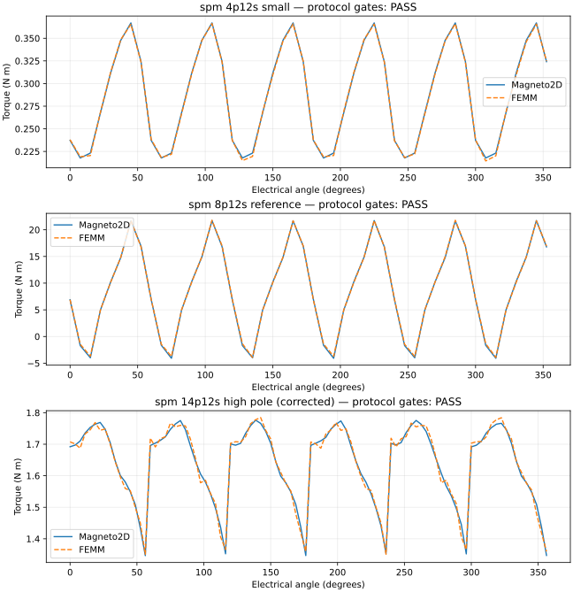

# Numerical evidence for the developer preview

**Experimental; not release-qualified.** These results were collected from a frozen,
isolated local publication candidate. All completed and failed comparison gates are
included in [the machine-readable evidence](../benchmarks/preview-evidence/results.json).

Local unpublished candidate commit: `3f5e2722fdf1eb5198d5b225d037d158b45a6497`. Native executable SHA-256:
`bb2e3c54f9b94da67a7e1efca324b880e7a65185a4a9f4b7229d5b12a4547b84`.

The current source includes subsequent environment and UI fixes. This is supporting
evidence for the frozen snapshot, not qualification of the final release commit.
Runtime file hashes distinguish the measured snapshot from later changes.
Source revisions cited below belong to the private development repository;
they are provenance identifiers, not commits available in this public repository.

The tested code uses the public environment isolation policy. Motor protocols use
explicit custom angular grids to align the native and FEMM results. Their labels
“standard” and “fine” refer to protocol sampling, not a certification of the UI presets.
FEMM used the same steel curve and matched magnet remanence/permeability; its executable
is not distributed here. Requests, runtime file hashes, reference executable hashes, methods and gates are
in the JSON. Results contain no reference-machine paths or personal identities.

| Case | Native mean torque (N m) | FEMM mean torque (N m) | Mean difference | Waveform NRMSE | Overall gates |
| --- | ---: | ---: | ---: | ---: | --- |
| bldc_spm_4p12s_small | 0.287059 | 0.286498 | 0.196% | 0.5072% | PASS |
| bldc_spm_8p12s_reference | 8.72867 | 8.80225 | 0.836% | 1.289% | PASS |
| bldc_spm_14p12s_high_pole | 1.63958 | 1.63999 | 0.02508% | 0.864% | FAIL ([corrected PASS below](#high-pole-correction-and-fresh-measurements)) |
| sine_spm_4p12s_m350_launch_no_load | 2.61625e-05 | Pending | Pending | Pending | PENDING |
| sine_spm_4p12s_m350_launch_rated_load | 0.478238 | Pending | Pending | Pending | PENDING |
| sine_spm_4p12s_m350_launch_saturation_stress | 0.717175 | Pending | Pending | Pending | PENDING |
| sine_spm_8p12s_m350_launch_no_load | 0.00337772 | Pending | Pending | Pending | PENDING |
| sine_spm_8p12s_m350_launch_rated_load | 19.1488 | Pending | Pending | Pending | PENDING |
| sine_spm_8p12s_m350_launch_saturation_stress | 28.7208 | Pending | Pending | Pending | PENDING |

For the six-step motor comparisons, the frozen limits are 5% mean-torque
difference and 10% waveform NRMSE. NRMSE is normalized by reference RMS torque.
Angular refinement must change mean torque by at most 2% and ripple by at most
5 percentage points. Current-command, commutation and low-current power/torque
consistency gates are also retained in the JSON. These are comparison tolerances,
not accuracy guarantees for arbitrary designs.
The refinement comparison doubles the angular sample count while retaining
the normal mesh-density setting; it does not establish spatial mesh convergence.

| Case | Mean change with angular refinement | Ripple change (percentage points) |
| --- | ---: | ---: |
| bldc_spm_4p12s_small | 0.2058% | 1.062 |
| bldc_spm_8p12s_reference | 0.1405% | 2.753 |
| bldc_spm_14p12s_high_pole | 0.4063% | 3.448 |

## High-pole correction and fresh measurements

The original high-pole run above failed phase-current sequence checks at exact
60°, 180° and 300° boundaries. Mechanical angles sent to the native CLI had been
rounded to nine decimal places. With seven pole pairs, that rounding crossed
an electrical boundary. The adapter now preserves full floating-point precision.
The imported mesh source currents retained their original precision; the
reported native phase currents used the rounded CLI angle. The original failure
remains visible above and in the JSON.

Fresh native runs from private source revision `65c340f5` repeat all three high-pole
lanes with identical requests, acceptance limits and the original FEMM reference.
Their overall gate result is **PASS**. The JSON retains both candidates,
raw-result hashes, waveforms and current-sequence checks.

| Mean torque difference | Waveform NRMSE | Current sequence / other protocol gates |
| ---: | ---: | --- |
| 0.02508% | 0.864% | PASS |

The high-pole plot below uses this corrected run. These follow-up measurements
do not replace final release-commit qualification or the pending sinusoidal references.

## Replay after runtime hardening

The native comparison grids were replayed from private source revision `763b9d25` after
the environment and UI fixes, using identical requests and the weighted-stress extractor.
The JSON retains both runtime file sets and replay-record hashes.

| Case | Maximum absolute torque difference from the frozen waveform (N m) |
| --- | ---: |
| bldc_spm_4p12s_small | 0 |
| bldc_spm_8p12s_reference | 0 |
| bldc_spm_14p12s_high_pole | 0 |

## Gates that did not pass

- `bldc_spm_14p12s_high_pole` / `native-standard_golden_current_sequence`: **FAIL**, value `native-standard: current phase sequence differs from golden table at 60.0 degrees`, limit `see JSON`.
- `bldc_spm_14p12s_high_pole` / `native-fine_golden_current_sequence`: **FAIL**, value `native-fine: current phase sequence differs from golden table at 60.0 degrees`, limit `see JSON`.
- `bldc_spm_14p12s_high_pole` / `analytical_golden_current_sequence`: **FAIL**, value `analytical: current phase sequence differs from golden table at 60.0 degrees`, limit `see JSON`.
- `sine_spm_4p12s_m350_launch_no_load`: **PENDING**.
- `sine_spm_4p12s_m350_launch_rated_load`: **PENDING**.
- `sine_spm_4p12s_m350_launch_saturation_stress`: **PENDING**.
- `sine_spm_8p12s_m350_launch_no_load`: **PENDING**.
- `sine_spm_8p12s_m350_launch_rated_load`: **PENDING**.
- `sine_spm_8p12s_m350_launch_saturation_stress`: **PENDING**.

## Independent analytical field check

A uniformly current-carrying circular conductor is compared against Ampère’s law.
The radius is 10 mm, current density is 5 MA/m², and the outer boundary is at 40 mm.
The sampled maximum relative error was **0.28%**, with an existing 5% test gate.
This checks the linear field solver; it does not validate nonlinear motor torque.

| Radius (mm) | Analytical B (T) | Native B (T) | Error |
| ---: | ---: | ---: | ---: |
| 5 | 0.01570796 | 0.01575145 | 0.28% |
| 8 | 0.02513274 | 0.02515061 | 0.07% |
| 15 | 0.02094395 | 0.02095478 | 0.05% |
| 25 | 0.01256637 | 0.01256392 | 0.02% |

Reproduce the analytical check:

```sh
cargo test --locked --manifest-path solvers/magneto2d/Cargo.toml uniform_current_cylinder_benchmark_reports_theory_error -- --nocapture
```

Replay a motor measurement from a fresh public checkout after the documented setup:

```sh
python -m tools.replay_numerical_case --case bldc_spm_4p12s_small --lane native-standard --output small-replay.json
```

Use the activated backend virtual environment. This performs a real solve and retains
a local run; the output file records the request, current commit and result.
Motor requests can also be replayed through the public `/solve` API using the exact `request`
objects in the JSON. The bundled `tools/run_public_benchmark.py` reproduces the
public-native sinusoidal benchmark rows. Reference generation requires a separate
FEMM installation. The comparison protocol maps the FEMM reference coordinate
convention to the public frame using angle = -angle modulo 360 degrees and
reverses reference torque sign.

## Interpretation limits

Inspect waveform and convergence gates as well as mean torque. A small mean difference
does not establish ripple accuracy. Rotor sweeps remesh or reuse symmetry-equivalent
meshes without a sliding band. Full sinusoidal airgap/harmonic diagnostics and final
release-commit qualification remain separate gates. No hardware measurement or
broad operating-system certification is implied.


